# The Knee surgery README

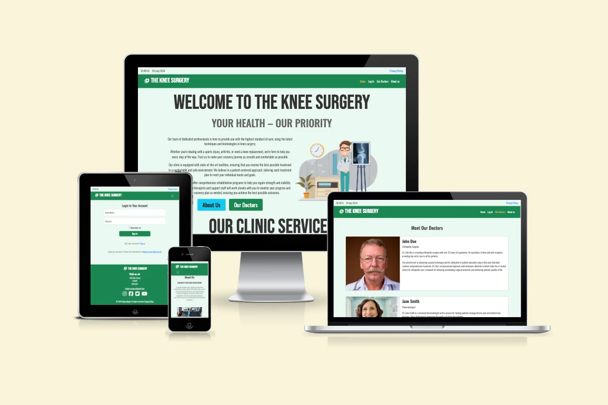

View the live site [here](https://theknee-surgery-f5b49706e9d6.herokuapp.com/)

## Introduction
Welcome to The Knee Surgery Clinic, your trusted destination for expert knee care and surgery. Our website is designed to offer patients a seamless experience, from registration to recovery. As a patient, you can easily register, request appointments, and communicate with our dedicated clinic staff. Our team is here to approve your requests, assign you to the right doctor, and schedule your appointments based on your specific needs. Doctors can review patient information, set exact dates and times for consultations, and update medical records to ensure you receive the best possible care. We are committed to providing a user-friendly platform that connects you with our skilled medical professionals and supports you throughout your knee surgery journey. Join us at The Knee Surgery Clinic and take the first step towards a healthier, pain-free life.

## Project Goals
The primary goal of The Knee Surgery Clinic website is to streamline the process of knee care for both patients and medical professionals. Our objectives include:

  1.	**Simplified Patient Registration**: Enable new patients to easily register on the platform and provide essential medical information.
  2.	**Efficient Appointment Requests**: Allow patients to request appointments with our doctors, ensuring that their needs are addressed promptly.
  3.	**Seamless Communication**: Facilitate clear and effective communication between patients, clinic staff, and doctors.
  4.	**Comprehensive Medical Record Management**: Provide doctors with the tools to manage and update patient medical records efficiently.
  5.	**Optimized Scheduling**: Assist clinic staff in approving appointment requests and assigning them to the appropriate doctors, ensuring that appointments are scheduled at convenient times for both patients and doctors.
  6.	**Enhanced User Experience**: Offer a user-friendly interface that simplifies the entire process, from registration to receiving care, making it accessible to all users.
  7.	**Patient Empowerment**: Empower patients with access to their medical records and the ability to track their treatment progress, promoting a proactive approach to their health.

Our mission is to provide a platform that not only improves the efficiency of clinic operations but also enhances the overall experience for our patients, ensuring they receive the best possible knee care.

## User Stories

### First Time Visitor Goals:

1. As a first-time visitor, I want to quickly understand what **The Knee surgery** offers so I can start managing my knee health effectively.
2. As a first-time visitor, I'm looking for an easy way to register as a patient and provide my medical information without any confusion, ensuring a smooth start.
3. As a first-time visitor, I want to learn about the clinic’s doctors and their expertise, so I feel assured about the quality of care I will receive.
4. As a first-time visitor, I’m looking for contact details and the clinic’s location to easily reach out for further assistance or plan a visit.

### Returning Visitor Goals:

1. As a returning visitor, I want to easily log into my account to access my medical records and upcoming appointment details.
2. As a returning visitor, I’m looking for a quick way to request a follow-up appointment or update an existing appointment.
3. As a returning visitor, I want to review and update my personal information to ensure my profile is current and accurate.

### Admin

As the site admin, I have the following capabilities:

1. Accept appointment requests from patients and assign them to specific doctors.
2. View and edit the profiles and information of any user on the site.
3. View a list of all users.
4. Delete users or reset their passwords.
5. Add new doctors.

### Doctor

As a doctor, I have the following capabilities:

1. Receive appointment requests from the admin for specific patients and schedule these appointments for specific dates and times.
2. View patient profiles.
3. Delete patient appointment requests.
4. Add, edit, and update medical records obtained during appointments with patients.

## User Experience (UX) &

User Interface (UI)

### Wireframes

<details>
<summary>Home Page</summary>

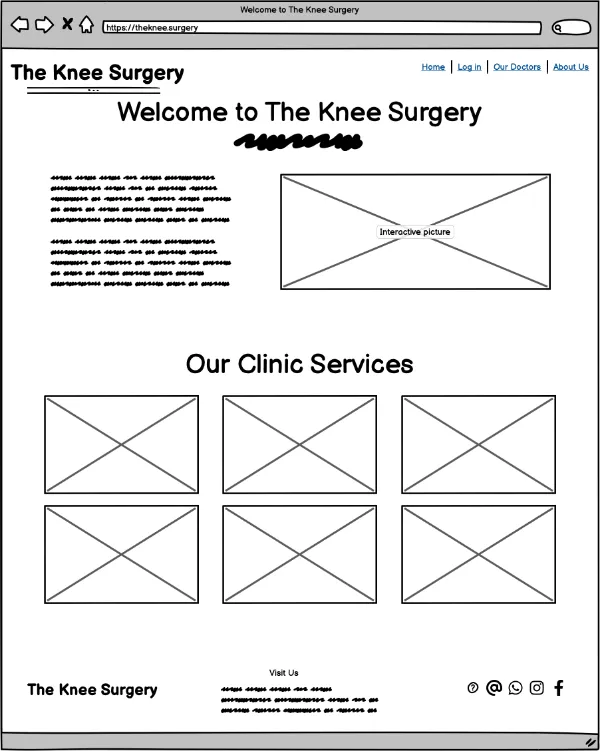
</details>

<details>
<summary>Log in Page</summary>

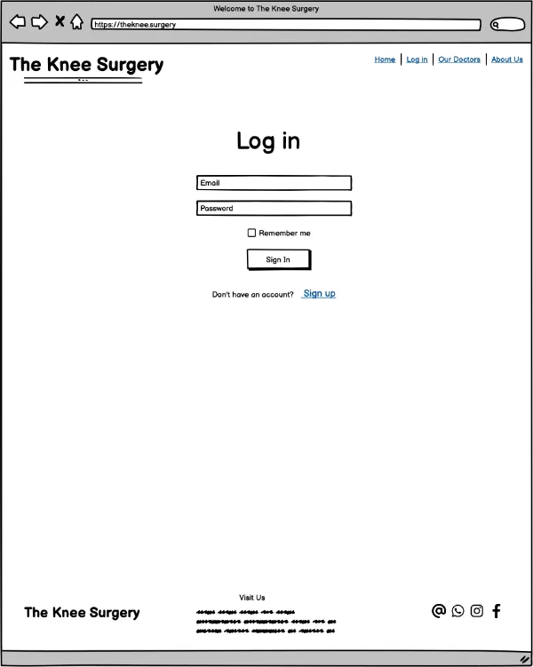
</details>

<details>
<summary>Sign Up Page</summary>

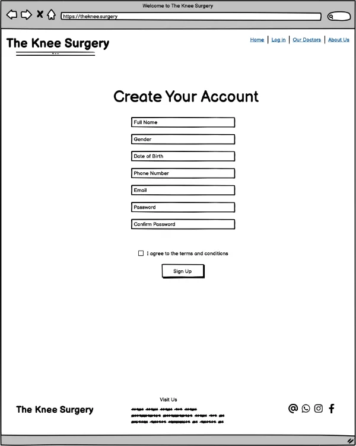
</details>

<details>
<summary>Our Doctors Page</summary>

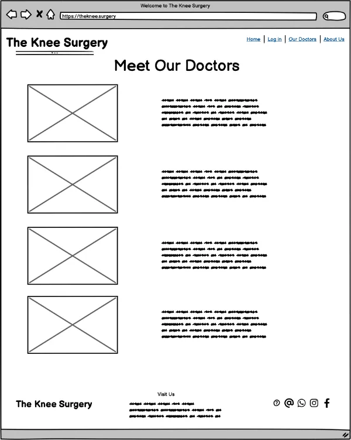
</details>

<details>
<summary>About Us Page</summary>

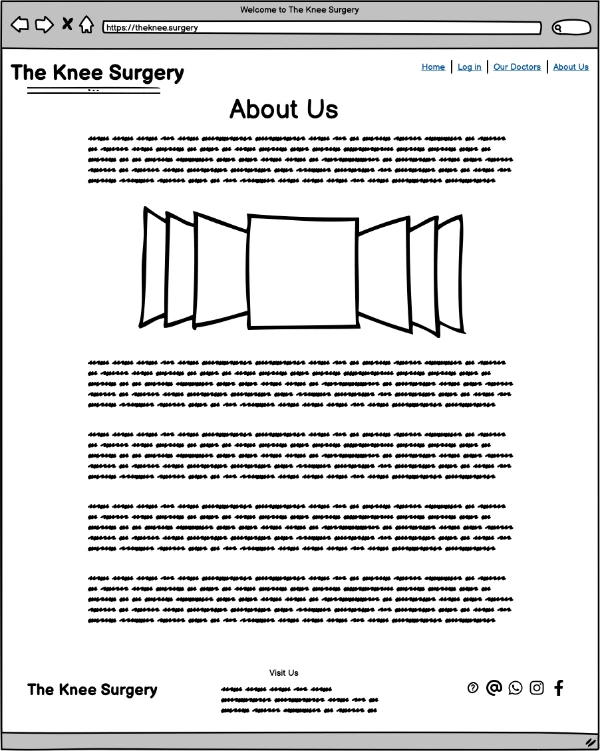
</details>

<details>
<summary>Privacy Policy Page</summary>

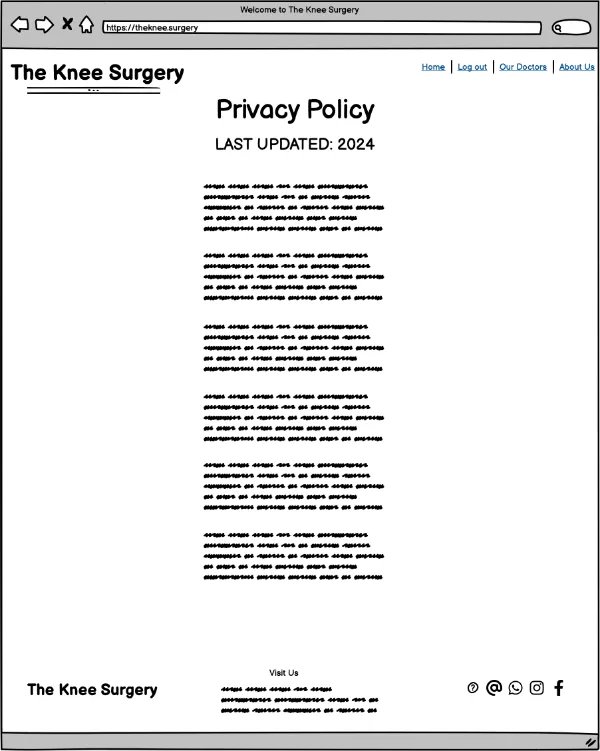
</details>

<details>
<summary>Profile Page</summary>

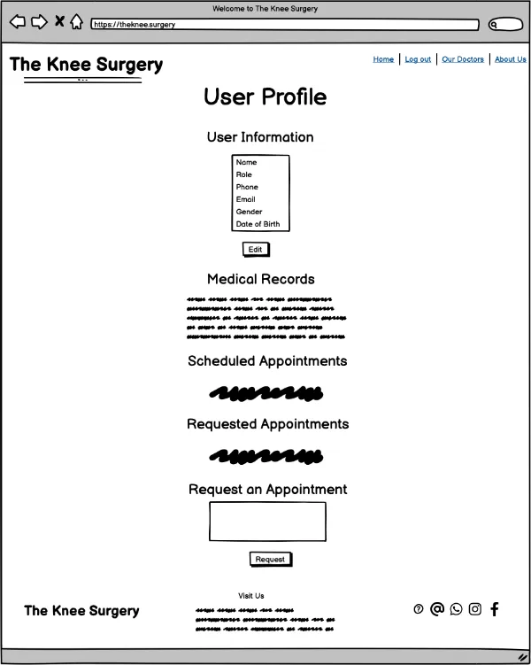
</details>

<details>
<summary>Add Doctor Page</summary>

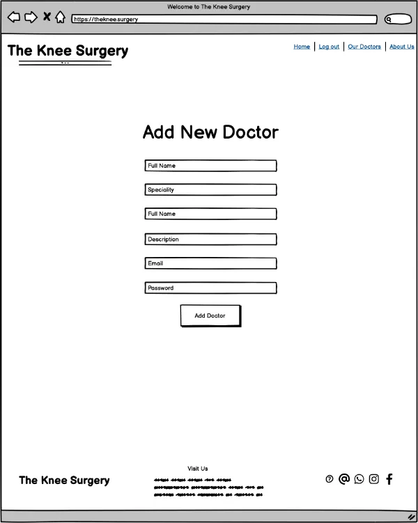
</details>

<details>
<summary>All Users Page</summary>

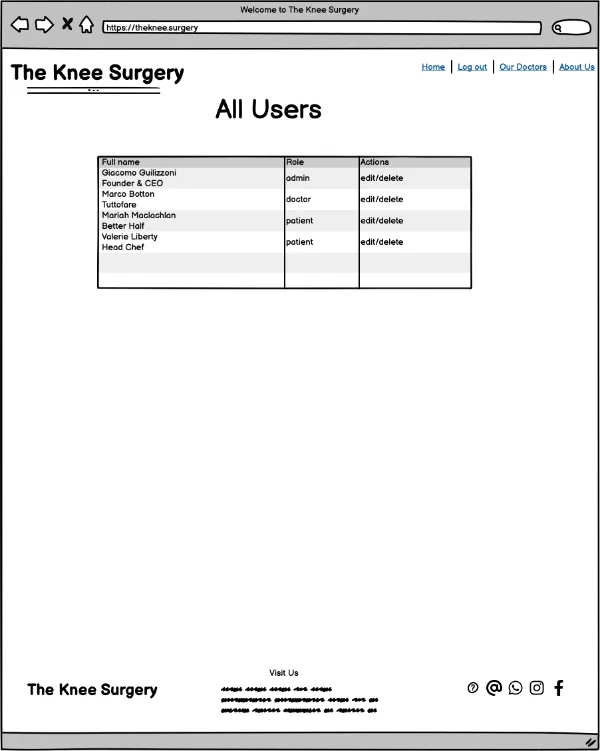
</details>

<details>
<summary> Medical Records Page</summary>

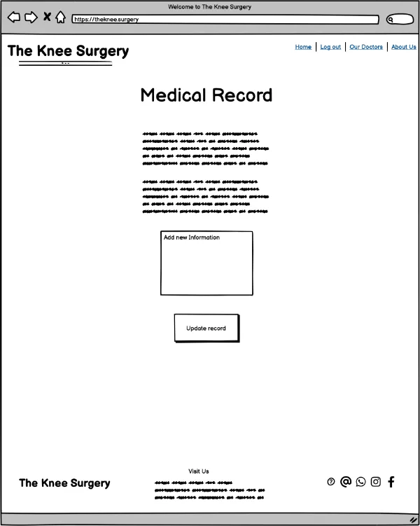
</details>

<details>
<summary>Map of website</summary>

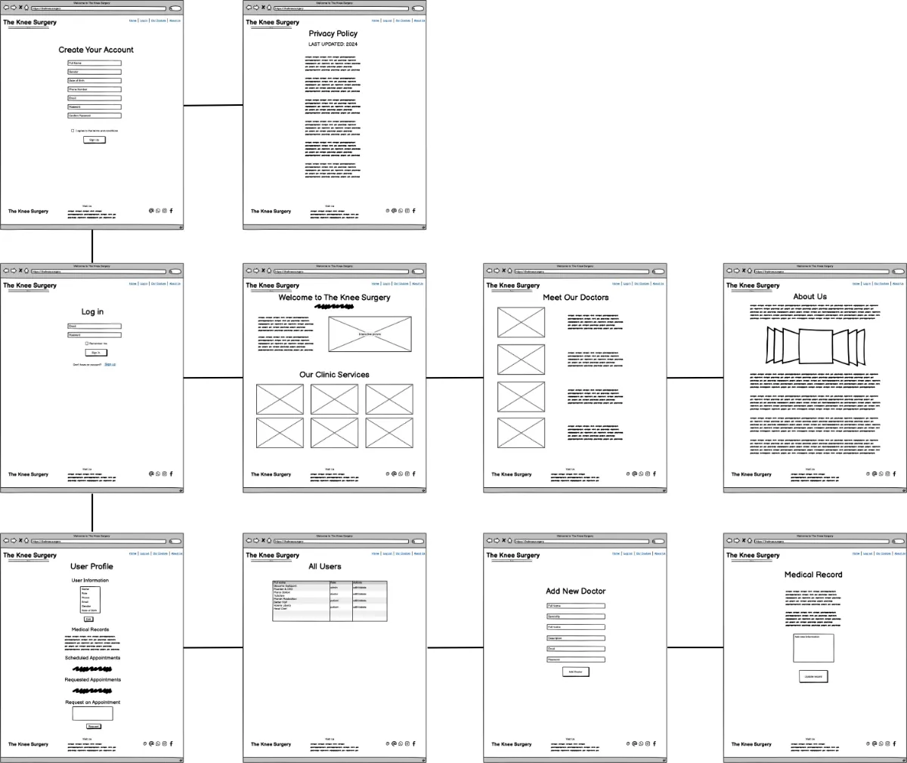

</details>


### Colour Scheme

#### Color Palette

The chosen color palette for The Knee Surgery is designed to evoke a sense of calmness and natural balance. The colors are as follows:

- **Primary Color**: `#198754` or Bootstrap bg-success (Green)
- **Secondary Color**: `#c8e6c9` (Light Green)
- **Accent Color**: `#ffffff` (White)
- **Complementary Color**: `#ffb74d` (Soft Orange)
- **Neutral Color**: `#9e9e9e` (Grey)

#### Color Psychology and Usage

- **Green (`#198754` or Bootstrap bg-success)**: This color represents health, growth, and tranquility. It is the primary color and will be used for main elements and headings to convey a sense of wellbeing and balance.
- **Light Green (`#c8e6c9`)**: Soft and calming, this color is ideal for background sections. It creates a serene and refreshing atmosphere, making the website more welcoming.
- **White (`#ffffff`)**: Symbolizing purity and simplicity, white will be used for text and borders to ensure clarity and readability.
- **Soft Orange (`#ffb74d`)**: Adding a touch of warmth and friendliness, soft orange will be used for call-to-action buttons, drawing attention without being too aggressive.
- **Grey (`#9e9e9e`)**: This neutral color provides balance and stability. It will be used for less prominent text, ensuring that primary content stands out without distraction.

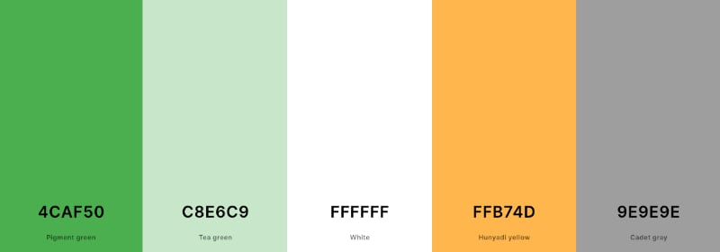

#### Visual Harmony and Accessibility

- **Contrast and Readability**: Ensure there is sufficient contrast between the primary color (Green) and the accent color (White) for text and important elements to maintain readability.
- **Balance**: Use soft orange sparingly to highlight key actions without overwhelming the natural and calm aesthetic of the site.
- **Consistency**: Maintain a consistent use of colors throughout the website to create a harmonious visual experience that supports the site’s calming and professional atmosphere.
- **Accessibility**: Consider accessibility guidelines, ensuring that all text is readable by maintaining an appropriate contrast ratio and using color combinations that are friendly for users with color vision deficiencies. This includes testing the color palette with accessibility tools to verify compliance with WCAG standards.

### Typography

Our website utilises a combination of modern and visually appealing fonts to enhance readability and user experience. We have integrated two main fonts, “Bebas Neue” and “Oswald”, which are imported from Google Fonts. These fonts are selected to create a clean and professional look, making the content easily digestible for our users.

#### Font Usage:

##### Bebas Neue:

- **Logo**: The site logo, defined under the .logo-setup and .navbar-brand classes, uses Bebas Neue to create a distinct and bold appearance.

- **Headings**: Main headings, such as the welcome title on the index page (.welcome-title), utilise Bebas Neue to make a strong visual impact.

##### Oswald:

- **Body Text**: The primary font for body text is Oswald. This includes the general text across the site, defined in the body tag. The font settings ensure a clean and readable design with font-weight: 300 and font-size: 17px.
- **Subtitles and Minor Headings**: Subtitles and minor headings, such as the welcome subtitle (.welcome-subtitle) and welcome text (.welcome-text), also use Oswald. These elements are styled with specific font sizes and transformations to maintain a cohesive look.
- **Forms and Buttons**: Text within forms and buttons, such as those on the login and signup pages, use Oswald to ensure readability and consistency throughout the user interface.

[**Font Awesome**](https://fontawesome.com/) icons were used throughout the site. These are useful for making buttons, input fields, and links clear for the user.

By using these fonts strategically, we aim to provide a cohesive and visually appealing user experience that enhances both readability and the overall aesthetic of the website.

### The Knee surgery Logo
The logo for The Knee Surgery clinic is designed to be both professional and approachable, reflecting the clinic’s commitment to high-quality care and patient comfort.

## Features

### Navigation
The navigation panel of The Knee Surgery clinic website is designed to provide a user-friendly and intuitive browsing experience.

#### Navbar
The Navbar section is designed with both aesthetics and functionality in mind. Below is a detailed breakdown of its features:

##### Additional Features

- **Clock and Date Display**: 
  - Above the navigation panel, you will find a clock and date display. This helps users keep track of the current time while browsing the site.

- **Future Search Bar**: 
  - As the website grows, a search bar will be added above the navigation panel. This will allow users to search for various information on the site. 
  - Although we planned to include this feature in the current project, we ran out of time.

##### Navigation Panel

- **Position and Behavior**: 
  - The navigation panel is located at the top of the page.
  - For design reasons, it does not remain fixed during scrolling.
  - As you scroll down, a back-to-top arrow appears in the bottom right corner. This arrow remains dynamically positioned as you scroll, allowing easy navigation back to the top of the page.

##### Layout and Responsiveness

- **Logo Placement**: 
  - The logo is situated on the left side of the navigation panel.

- **Menu Items**: 
  - The menu items, which change based on user authentication status, are located on the right side of the panel.
  - As the screen size decreases, the menu items and the logo first move towards the center. Eventually, the menu items transform into a hamburger menu, thanks to Bootstrap classes.

##### Menu Item Descriptions

- **Intuitive Labels**: 
  - The pages linked by the menu items are self-explanatory based on their labels.

##### Desktop View:

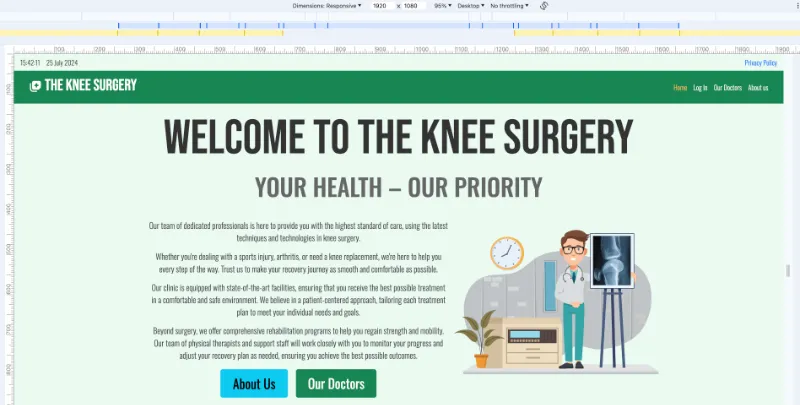

##### Responsive Design:

##### Tablet View:

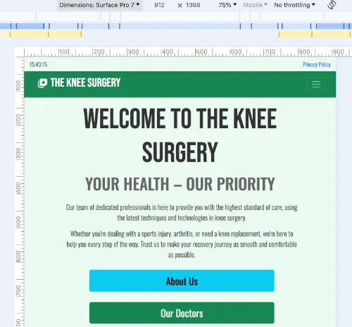
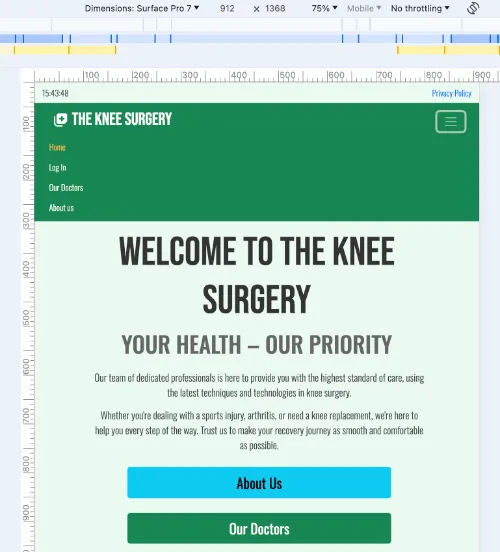

##### Mobile View:

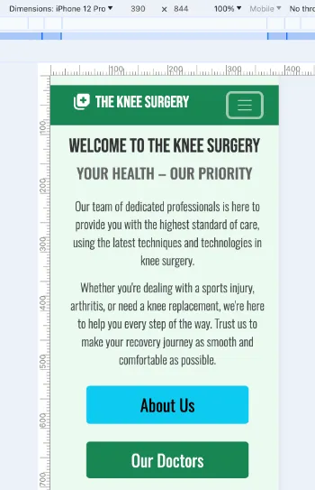
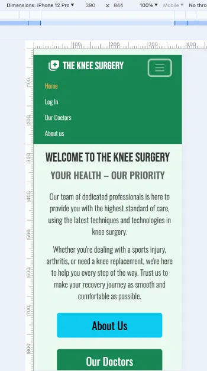

### Footer

The footer section of our website is designed to provide essential information and easy access to our social media channels. Below is a detailed description of its features and layout across different devices:

##### Desktop View:


- **Logo and Company Name**: 
  - Located on the left side of the footer, the company logo and name, "THE KNEE SURGERY," are prominently displayed.

- **Contact Information**: 
  - In the center, visitors can find our contact details:
    - **Address**: 456 Side Street, Cardiff, CF19 6FY
    - **Email**: theknee.surgery@gmail.com

- **Social Media Icons**: 
  - To the right, icons for Instagram, Facebook, Twitter, and YouTube are displayed, providing quick links to our social media profiles.

- **Copyright and Privacy Policy**:
  - At the bottom, it states: "© 2024 Artem Bryzh. All rights reserved." 
  - A link to the Privacy Policy is also provided.

##### Responsive Design:

##### Tablet View:


- **Logo and Company Name**: 
  - Located centrally.

- **Contact Information**:
  - Positioned centrally with the same details as the desktop view.

- **Social Media Icons**:
  - Aligned below the contact information, allowing easy access.

- **Back to Top Arrow**:
  - A convenient back-to-top arrow is present, aiding navigation.

##### Mobile View:

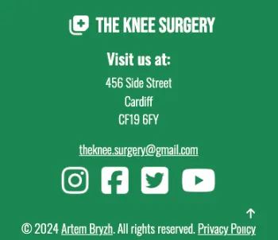

- **Logo and Company Name**: 
  - The company logo and name remain at the top, positioned centrally, ensuring brand visibility.

- **Contact Information**: 
  - Centrally aligned for easy reading.

- **Social Media Icons**: 
  - Arranged below the contact information in a horizontal layout.

- **Back to Top Arrow**:
  - Located at the bottom right corner, this arrow aids in easy navigation back to the top of the page.

The footer is designed to be responsive and user-friendly across all devices, ensuring that visitors can easily find contact information and access our social media channels, no matter the device they are using.

### Home Page
Welcome to The Knee Surgery homepage, designed with user experience and functionality in mind. Here’s a breakdown of its features:

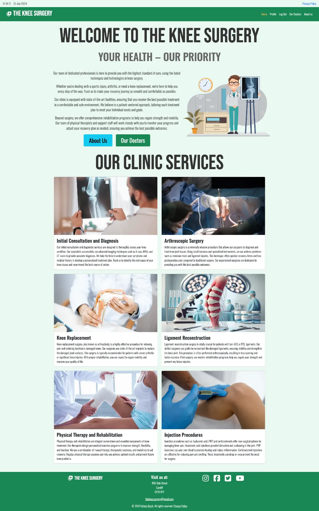

- **Introduction Section**: 
  - Contains a brief overview of our commitment to knee surgery and patient care.
  - Includes two prominent buttons for easy navigation: "Our Doctors" and "About Us"

- **Future Interactive Image**: 
  - A placeholder image that will be interactive in future updates, enhancing user engagement and providing more information visually.

- **Comprehensive List of Services**:
  - **Initial Consultation and Diagnosis**: Personalized assessment plans.
  - **Arthroscopic Surgery**: Minimally invasive procedures.
  - **Knee Replacement**: Advanced techniques and implants.
  - **Ligament Reconstruction**: Restoring knee stability.
  - **Physical Therapy and Rehabilitation**: Customized exercise programs.
  - **Injection Procedures**: Non-surgical pain management options.

### Log In Page
The Log In page allows users to access their accounts on The Knee Surgery website. The page includes the following features:

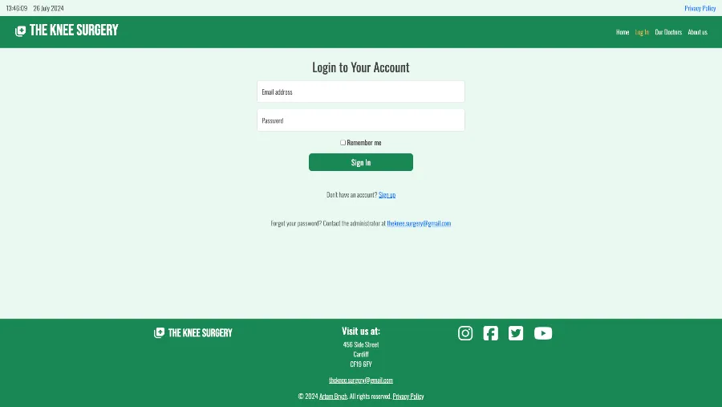

1. **Email Input**: Users enter their email address in a floating label input field.
2. **Password Input**: Users enter their password in a floating label input field.
3. **Remember Me Checkbox**: Users can choose to stay logged in for 30 days.
4. **Sign In Button**: Submits the form to log in the user.
5. **Sign Up Link**: Redirects new users to the sign-up page.
6. **Forgot Password**: Provides the administrator's email for password reset assistance.

When the "Sign In" button is clicked, the user's credentials are validated on the backend. If the credentials are correct, the user is logged in; otherwise, a flash message indicates incorrect email or password.

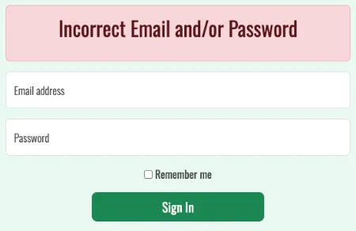

The "Remember Me" checkbox is processed on the backend. The backend code uses Flask session management to keep the user logged in if the checkbox is selected.

      ```python
      from flask import session

      # Session configuration
      app.config["SESSION_PERMANENT"] = False  # Session is not permanent by default
      app.config["PERMANENT_SESSION_LIFETIME"] = timedelta(days=30)

      if existing_user:
              # Set session to be permanent if remember me is checked
              if remember:
                  # This sets the session to use the permanent lifetime
                  session.permanent = True
                  # Set session lifetime to 30 days
                  app.permanent_session_lifetime = timedelta(days=30)

Clicking on the administrator’s email opens the mail program with the “To” field filled out. 

### Sign Up Page
The sign-up page allows new users to create an account on The Knee Surgery website. The form includes client-side validation using JavaScript to ensure the password meets the criteria and matches the confirmation password. The backend handles additional validation, password hashing, and user creation.

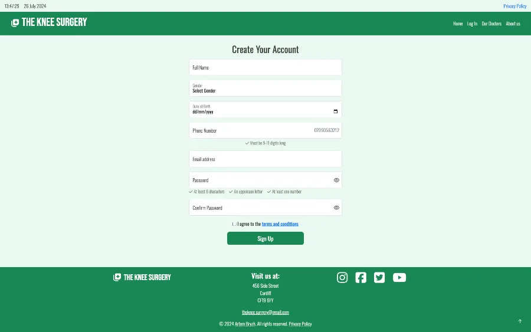

The page includes the following features:

1. **Full Name Input**: Users enter their full name in a floating label input field.
2. **Gender Selection**: Users select their gender from a dropdown list.
3. **Date of Birth Input**: Users enter their date of birth in a floating label input field.
4. **Phone Number Input**: Users enter their phone number, which must be between 9 to 11 digits. JavaScript handles input changes to show or hide a sample text.
5. **Email Input**: Users enter their email address in a floating label input field.
6. **Password Input**: Users create a password with requirements displayed below the input field. The password must be at least 8 characters long, contain an uppercase letter, and a number. JavaScript validates the password in real-time. Gray check marks turn green as each requirement is met.

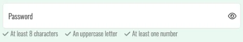

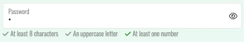

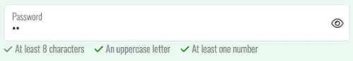

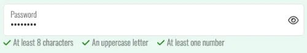

7. **Confirm Password Input**: Users confirm their password. JavaScript ensures that both password fields match. Each password field includes a Font Awesome eye icon that toggles password visibility when clicked.

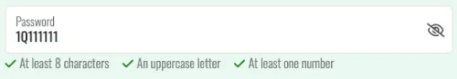

8. **Terms and Conditions Checkbox**: Users must agree to the terms and conditions. Clicking the link opens a modal with the terms for review.

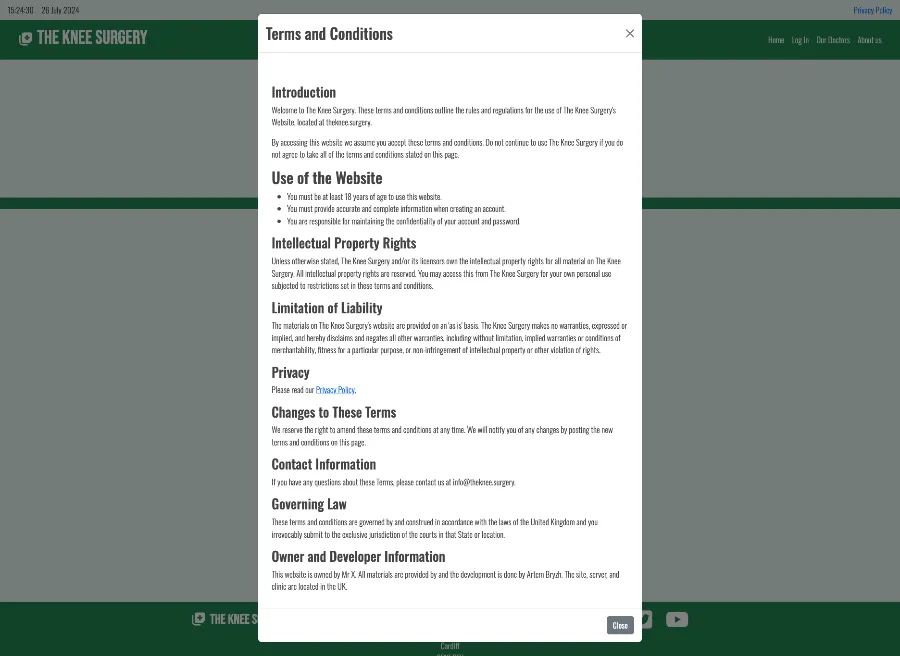

Users must agree to the terms and conditions. Without checking this box, users cannot complete the registration.

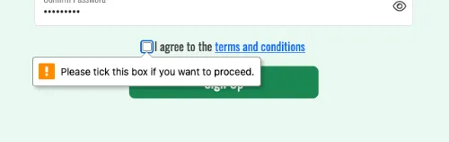

On the backend, the following occurs:

- **Email Validation**: The backend checks if the email is already registered.
- **Password Validation**: The backend ensures the passwords match and meet the requirements.
- **Password Hashing**: The password is hashed using `generate_password_hash`.
- **User Creation**: A new user record is created and saved in the database.
- **Session Handling**: The user's email is added to the session to log them in automatically.

### Privacy Policy Page
The Privacy Policy page provides detailed information about how The Knee Surgery website collects, uses, and protects user data. It is a crucial component for informing users about their privacy rights and the measures taken to safeguard their information. 

<details>
<summary>See Privacy policy Page</summary>

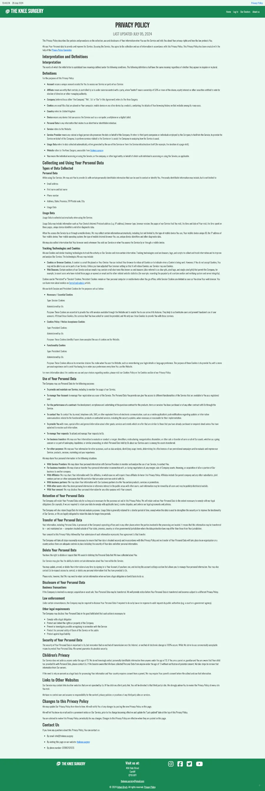
</details><br>
  
The policy includes sections on:

- **Data Collection**: Explains what personal data is collected, such as email addresses, names, phone numbers, and usage data.
- **Usage of Data**: Describes how the collected data is used to provide and improve services.
- **Cookies and Tracking**: Details the use of cookies and other tracking technologies to enhance user experience.
- **Data Sharing**: Outlines conditions under which user data may be shared with third parties.
- **Data Security**: Ensures the protection of personal data, though it acknowledges no method is 100% secure.
- **Children’s Privacy**: States the service does not address users under 13 and the measures taken if such data is inadvertently collected.
- **External Links**: Advises users to review privacy policies of linked websites not operated by The Knee Surgery.
- **Policy Changes**: Notifies users that the Privacy Policy may be updated and the process for informing users of changes.

This Privacy Policy was generated and adapted using the [Privacy Policy Generator](https://www.termsfeed.com/privacy-policy-generator/).

### Our Doctors Page


### About us Page

### Profile Page

### All Users Page

### Add Doctor Page

### Medical Records Page

#### Navigation Controls:

#### Content Layout:

## Technologies Used

## Testing

### Responsiveness

### Validator testing

#### HTML

#### CSS

#### JavaScript

### LightHouse report

### Compatibility

### Bugs

#### SSL

**SSL Certificate Verification Failed When Connecting to MongoDB:** Encountered an SSL certificate verification error (SSL: CERTIFICATE_VERIFY_FAILED) when trying to connect to MongoDB.

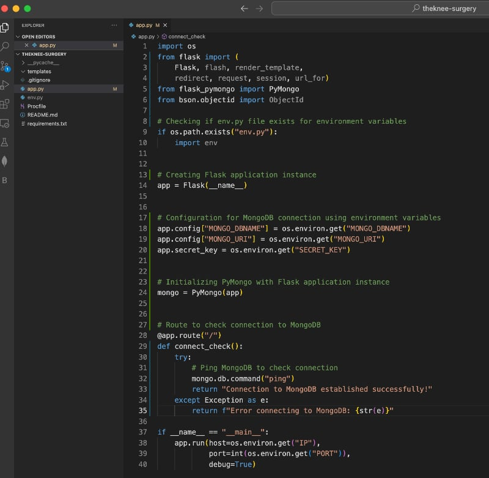
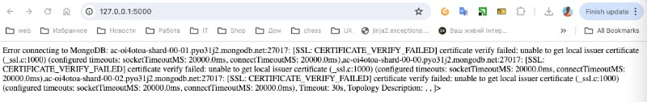

**Solution:** Resolved the issue by adding the certifi library (import certifi) and modifying the PyMongo initialization line to specify the tlsCAFile parameter.

**Code Changes and Result:**

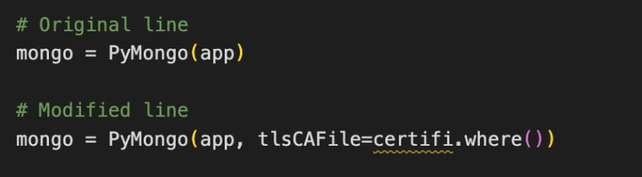
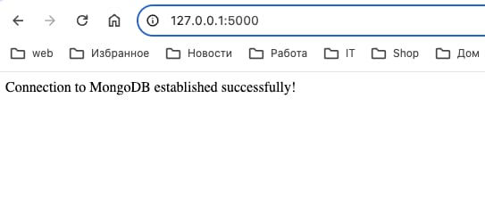

#### Logout Issue

**Problem:**
When a user clicks the "Log Out" link and confirms the logout, the user is redirected to the homepage, but the navigation menu still shows the logged-in state (i.e., it still shows "Profile" and "Log Out" instead of "Log In" and "Sign Up"). Additionally, the user can still access the profile page.
**Steps to Reproduce:**

1.  Log in to your account.
2.  Click the "Log Out" link.
3.  Confirm the logout.
    **Cause:**
    The issue was caused by the JavaScript code for the logout not being correctly executed within the context of the Flask application, leading to the user session not being properly terminated on the server side. This issue is specific to how Jinja templates are rendered and how JavaScript interacts with the Flask backend.
    Initially, the JavaScript code for the logout was included in a custom JavaScript file. This caused the problem as described because the Jinja templating was not correctly interacting with the external JavaScript file. Once the code was moved directly into the `base.html` template, everything worked as expected.
    **Solution:**
    Ensure the JavaScript code is included at the right place in the `base.html` template to properly interact with the Flask backend:

            ```html
            <!-- Inline script for logout modal -->
            <script>
              $(document).ready(function () {
                // Attach a click event handler to the confirmLogout button
                $("#confirmLogout").click(function () {
                  // Redirect the user to the logout URL
                  window.location.href = "{{ url_for('logout') }}"
                })
              })
            </script>
            ```

        After implementing the above solution, the logout functionality works as expected, with the user being properly logged out and the navigation menu updating correctly to reflect the logged-out state.

#### User Email Update Issue

**Problem:**
When a user updates their email address in the profile settings, the user remains logged in with the new email address, but they are redirected to the home page. Upon returning to the profile page, the user’s profile information is displayed correctly, but a “User not found” notification appears at the top of the page.

**Steps to Reproduce:**

    1.	Log in to your account.
    2.	Go to the profile page.
    3.	Click the “Edit” button to enable editing mode.
    4.	Change the email address to a new valid email address.
    5.	Enter the current password and click “Save.”
    6.	Observe the redirection to the home page.
    7.	Navigate back to the profile page.
    8.	Observe the “User not found” notification at the top of the page.

**Expected Behavior:**

    •	The user should remain on the profile page after updating the email address.
    •	No “User not found” notification should appear if the profile information is displayed correctly.

**Actual Behavior:**

    •	The user is redirected to the home page after updating the email address.
    •	A “User not found” notification appears at the top of the profile page upon returning.

**Screenshot:**


**Cause:**
The issue was caused by the Flask application not correctly updating the session and redirecting after an email change. Although the session email was updated, the redirection logic did not reflect the new session state, leading to the user being treated as unauthenticated or non-existent in subsequent requests.

**Solution:**
Ensure that after updating the email in the session, the user is redirected correctly and the session state is fully updated:

      ```python
      # Update session email if changed
      if current_email != new_email:
          session["user"] = new_email
          flash("Your email has been updated to {}.".format(new_email), "success")
          return {"success": True, "message": "Your email has been updated.", "redirect": url_for("profile", username=new_email)}
      else:
          flash("Your information has been updated.", "success")
          return {"success": True, "message": "Your information has been updated.", "redirect": url_for("profile", username=current_email)}

Ensure the JavaScript handles the success response correctly:

      ```javascript
      success: function (response) {
        if (response.success) {
          alert(response.message);
          window.location.href = response.redirect; // Updated to redirect after successful email change
        } else {
          alert(response.message);
        }
      }

After implementing the above solution, the email change functionality works as expected, keeping the user authenticated with the new email address and displaying the appropriate success message on the profile page.


### Unsolved Bugs

### Mistakes

## Deployment

### Deployment to GitHub Pages

### Deployment to Heroku

### Local Deployment

## Credits

### Content

#### Terms and Conditions

The Terms and Conditions for this project were sourced from [TermsFeed](https://www.termsfeed.com/), a platform that provides templates and generators for legal documents. These terms were adapted to fit the specific needs of The Knee Surgery website, ensuring that they are relevant to the services provided and the target audience. This addition helps make the project more realistic and professional by outlining the legal guidelines and user responsibilities clearly.

#### Privacy Policy

The Privacy Policy was also generated using [TermsFeed](https://www.termsfeed.com/), ensuring comprehensive coverage of all necessary legal aspects related to user data and privacy. This policy was customized to align with the operations and data handling practices of The Knee Surgery website. Including a Privacy Policy enhances the authenticity of the project, demonstrating a commitment to user privacy and data protection, which is crucial for any real-world website.

### Images

#### Index page

1. Doctor Illustrator Design, [License.](documentation/licenses/photos/image-1-license-certificate.txt)
2. Physiotherapist check X ray, [License.](documentation/licenses/photos/image-2-license-certificate.txt)
3. Hands operating a patient, [License.](documentation/licenses/photos/image-3-license-certificate.txt)
4. Knee joint model , [License.](documentation/licenses/photos/image-4-license-certificate.txt)
5. Ligament Reconstruction image was generated using AI from [ChatGPT](https://www.openai.com/chatgpt)
6. Bandaging woman's injured knee, [License.](documentation/licenses/photos/image-6-license-certificate.txt)
7. Injection Procedures, [License.](documentation/licenses/photos/image-7-license-certificate.txt)

#### Our Doctors page

1. Dr. John Doe photo, [License.](documentation/licenses/photos/image-8-license-certificate.txt)
2. Dr. Jane Smith photo, [License.](documentation/licenses/photos/image-9-license-certificate.txt)
3. Dr. Emily Johnson photo, [License.](documentation/licenses/photos/image-10-license-certificate.txt)
4. Dr. Michael Brown photo, [License.](documentation/licenses/photos/image-11-license-certificate.txt)

#### About Us page

1. Hospital reception counter, [License.](documentation/licenses/photos/image-12-license-certificate.txt)
2. Busy Hospital Corridor, [License.](documentation/licenses/photos/image-13-license-certificate.txt)
3. Modern operating theatre, [License.](documentation/licenses/photos/image-14-license-certificate.txt)
4. A room of an hospital, [License.](documentation/licenses/photos/image-15-license-certificate.txt)

## Acknowledgments

## Future Improvements